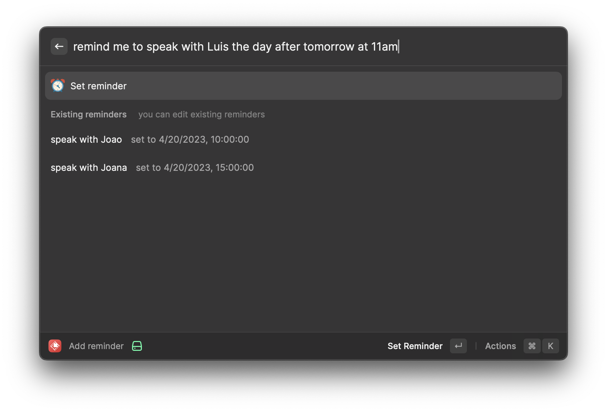
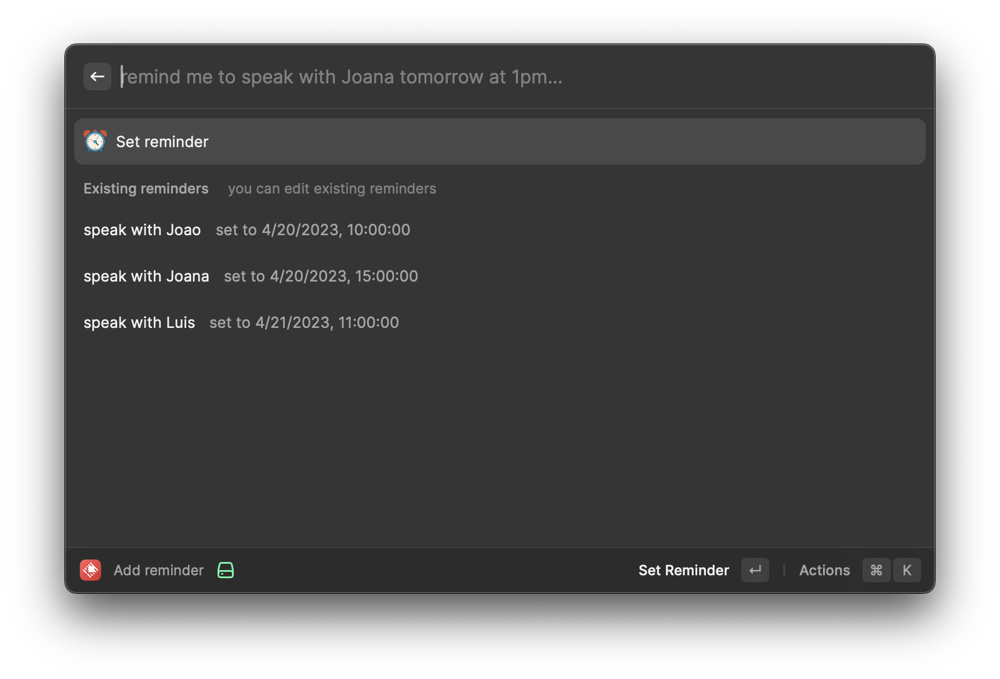
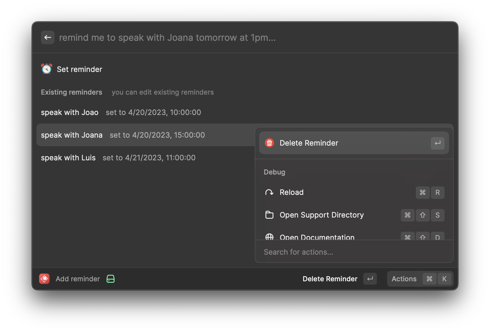
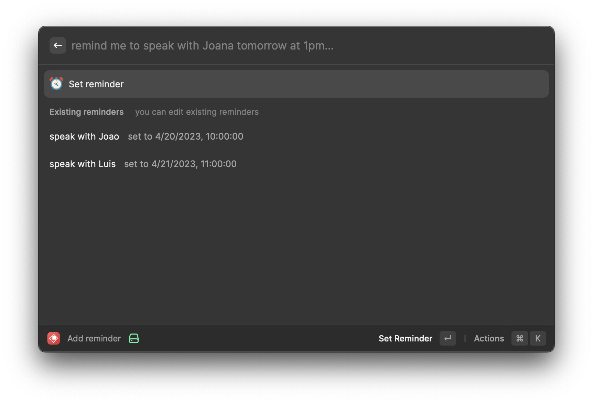

# Simple Reminder

Set your reminders in plain english without the need to have any application installed.

## Example usage

```text
    > remind me to speak with Jane on May 18th at 6pm
    > remind me to buy lunch today at noon
    > remind me to schedule the hotel for the weekend this friday at 7pm
```

## Screenshots







